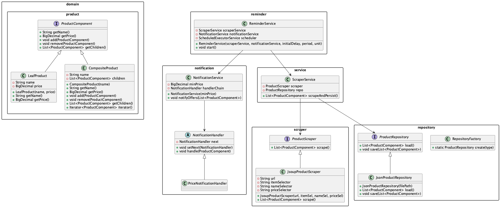

# shopping-bot
=======
# Beauty Shopping Smart Bot

## Descrizione
Bot Java per:
- **Scraping** di prodotti make-up e skin-care da un sito web
- **Persistenza** in JSON
- **Filtri** tramite Stream API
- **Notifiche** basate su Chain of Responsibility
- **Reminder** periodici via ScheduledExecutorService
- **Logging** centralizzato con Log4j2 (console + file rolling)

## Requisiti
- Java 17
- Maven 3.8+
- Connessione internet per scraping (o fallback demo)

## Build ed esecuzione
```bash
mvn clean compile
mvn exec:java \
  -Dexec.mainClass="com.beautybot.App" \
  -Dexec.args="https://example.com/products.html 15.00"
``` 

## Dependency Injection
Utilizziamo **Guice** per:
- Iniettare `ProductScraper` e `ProductRepository`  
- Configurare la soglia `minPrice`  
tramite il modulo `com.beautybot.di.BeautyBotModule`.

## Javadoc
Ogni classe è documentata con Javadoc che spiega i pattern utilizzati:
- **Composite** (`ProductComponent`, `LeafProduct`, `CompositeProduct`)  
- **Iterator** (`ProductComponentIterator`)  
- **Factory** (`RepositoryFactory`)  
- **Shielding** (`ScraperService` con RuntimeException)  
- **Chain of Responsibility** (`NotificationService`, `NotificationHandler`)  
- **Dependency Injection** (Guice e `BeautyBotModule`)  
- **Asynchronous Reminder** (`ReminderService` con ScheduledExecutorService`)

## Class Diagram



